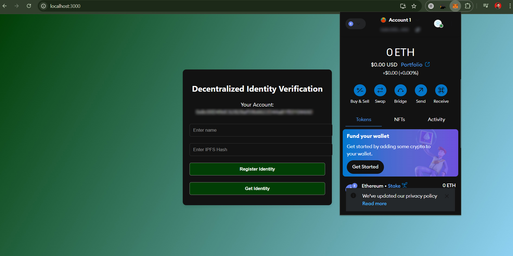

# Decentralized Identity Verification

A decentralized identity verification system where users control their identity and personal information on the blockchain. This project aims to provide a secure and transparent way of verifying identities without relying on centralized authorities.

 <!-- Replace with an actual screenshot of the project interface -->

## Table of Contents
- [Features](#features)
- [Tech Stack](#tech-stack)
- [Installation](#installation)
- [Usage](#usage)
- [Deployment](#deployment)
- [License](#license)

## Features
- **Self-sovereign identity**: Users have control over their own identities.
- **Blockchain security**: Data is stored securely and immutably on the blockchain.
- **IPFS for storage**: Utilizes IPFS to store identity information securely and efficiently.
- **Ethereum-based**: The project is built on the Ethereum blockchain with smart contracts in Solidity.

## Tech Stack
- **Frontend**: React, CSS
- **Blockchain**: Ethereum, Solidity
- **Storage**: IPFS
- **Wallet Integration**: MetaMask

## Installation

To run this project locally, follow these steps:

### Prerequisites
Make sure you have the following installed:
- [Node.js](https://nodejs.org/) (v14 or higher)
- [MetaMask](https://metamask.io/) extension in your browser
- [IPFS](https://ipfs.io/) (optional, if you want to set up IPFS locally)

### Step 1: Clone the Repository
```bash
git clone https://github.com/your-username/Decentralized-Identity-Verification.git
cd Decentralized-Identity-Verification
